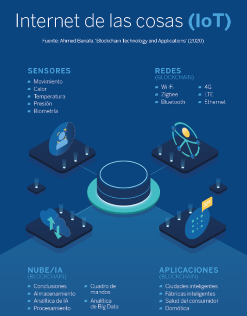
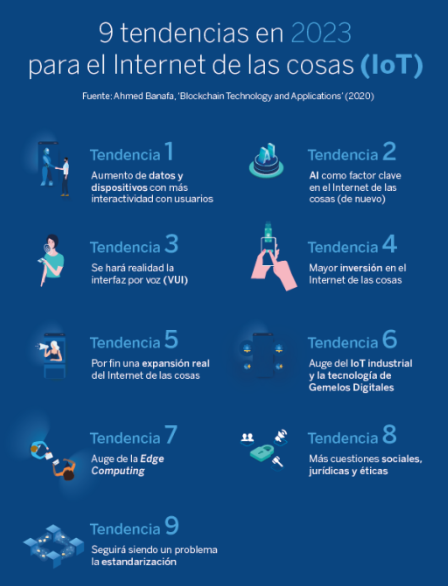
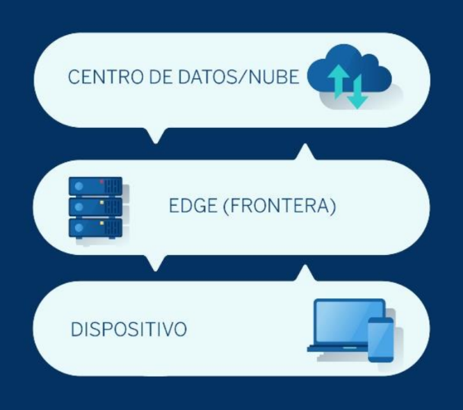
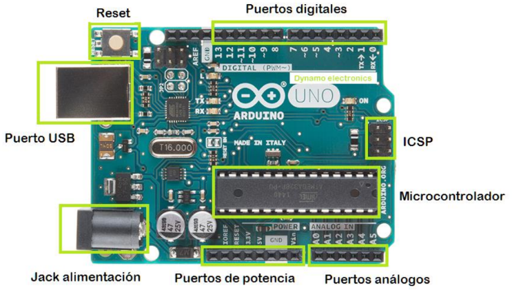

# Avances en Tecnologia I

## Ingeniería del Software
Análisis, diseño, programación, prueba y mantenimiento de sistemas informáticos.
Desarrollo y mantenimiento de software eficiente, confiable y de calidad; ingeniería aplicada.

- Proceso de Desarrollo: Eficiencia en desarrollo de software mediante procesos sistemáticos y reproducibles.
- Calidad del Software: Énfasis en calidad mediante estándares, robustez y fácil mantenimiento del software.
- Gestión de Proyectos: Planificación, programación, seguimiento y control para entrega eficiente y económica.
- Análisis y Diseño de Software: Análisis detallado, diseño arquitectónico: clave antes de codificar software.
- Pruebas de Software: Pruebas identifican errores, garantizan funcionamiento del software en ingeniería.
- Mantenimiento del Software: Mantenimiento continuo de software para corrección, mejoras y adaptación.

## Algunas funciones del Ing Software
- Utiliza los principios de la informática para desarrollar soluciones de software que satisfagan los deseos y necesidades.
- Utilizando lenguajes de programación, marcos, bases de datos, servidores y otras tecnologías para convertir una idea en un producto final.

## Avances en Tecnología
Tecnologías como los robots, iot, la inteligencia artificial y machine learning evolucionan a paso veloz.

- 5G: Velocidades de Descarga Mejoradas, Baja Latencia, Mayor Capacidad de Conexión.

# Avances en Tecnologia II

## MIT Technology Review

1. Internet imposible de hackear (Unhackable internet): aplicar las propiedades de la física cuántica.
2. Medicina hiperpersonalizada (Hyper-personalized medicine): medicina genética adaptada a un solo paciente.
3. Dinero digital (Digital money).
4. Medicamentos contra el envejecimiento (Anti-aging drugs).
5. Moléculas descubiertas gracias a la Inteligencia Artificial (AI-discovered molecules).
6. Mega constelaciones de satélites (Satellite mega-constellations): proporcionar Internet de banda ancha a cualquier tipo de dispositivo, desde un terminal telefónico hasta dispositivos de IoT
7. Supremacía cuántica (Quantum supremacy): ordenadores cuánticos serán capaces de resolver problemas que ninguna otra máquina es capaz de resolver hoy en día.
8. Inteligencia Artificial diminuta (Tiny AI): nueva generación de microprocesadores especializados.
9. Privacidad diferencial (Differential privacy): es necesario introducir “ruido” en los datos, de manera que nos aseguremos de que cruzando los datos disponibles, es imposible identificar a un individuo concreto.
10. Responsabilidad del cambio climático (Climate change attribution).

## Transformacion Digital hacia la Nube

# Hardware y Software I
- Gadgets Gamers.
- Celulares Plegables/Enrrollables.
- Laptops Plegables.
- Tecnología para llevar: Gafas, Smartwatch.
- Software: Alexa vs Google (Siri).
- Software: Realidad Aumentada, Inteligencia Artificial.
- Motiv Ring - El Anillo Fitness.
- I'm here: Pequeño accesoria que mediante conectividad bluetooth te lleva al lugar en donde se encuentra lo que estas buscando.
- Haize: GPS para ciclistas.
- Oppy: camera.
- RoadWayve: mensajes para el auto.
- SideKicks: desncanso digital.

# Hardware y Software II

## Inteligencia Artificial
1. Sistemas que piensan como humanos: redes neuronales artificiales.
2. Sistemas que actúan como humanos.
3. Sistemas que piensan racionalmente: sistemas expertos.
4. Sistemas que actúan racionalmente.

- La IA predice la propagación de la enfermedad.
- La AI ayuda a los centros de apoyo.
- La IA combate la propagación de información errónea.
- La AI identifica a pacientes enfermos.

## Inteligencia Artificial Cambio Climático
- El laboratorio DeepMind de Google. se depende menos de los combustibles convencionales.
- Microsoft y Long Live the Kings.

## Legislación de Inteligencia Artificial
- Parlamento Europeo: normativas para regular su uso y empleo.
    - Los robots deberán contar con un interruptor de emergencia.
    - Estas máquinas no podrán hacer daño a los seres humanos.  
    - No podrán generarse relaciones emocionales.
    - Será obligatoria la contratación de un seguro.
    - Sus derechos y obligaciones serán clasificados legalmente.
    - Las máquinas de la IA deberán ayudar con sus impuestos a las ayudas para los desempleados.

## CHATGTP
- Generative Pre-training Transformer.

# Hardware y Software III

## Internet de las Cosas
- hace referencia a la tendencia constante de conectar todo tipo de objetos físicos al Internet.

## Internet de las Cosas / Empresarial
- El volumen de datos que un sistema de dispositivos inteligentes es capaz de producir es impresionante.





1. AUMENTO DE DATOS Y DISPOSITIVOS CON MÁS INTERACTIVIDAD CON USUARIOS
2. IA COMO FACTOR CLAVE EN EL INTERNET DE LAS COSAS (DE NUEVO)
3. SE HARÁ REALIDAD LA INTERFAZ POR VOZ (VUI)
4. MAYOR INVERSIÓN EN EL INTERNET DE LAS COSAS
5. POR FIN UNA EXPANSIÓN REAL DEL INTERNET DE LAS COSAS
6. AUGE DEL IOT INDUSTRIAL Y LA TECNOLOGÍA DE GEMELOS DIGITALES
7. AUGE DE LA «EDGE COMPUTING»: computación «en la frontera» es una tecnología que distribuye la labor de procesamiento acercándola a la frontera de la red (en el caso del Internet de las cosas, a los sensores). ``implica incorporar la IA``



# Arduino

- Arduino es un micro controlador de código abierto, una sencilla y económica placa con entradas y salidas, analógicas y digitales, en un entorno de desarrollo en el lenguaje de programación Processing basado en Java con una fácil curva de aprendizaje.

- Arduino utiliza un lenguaje de programación propio, basado en C/C++12345. Este lenguaje se llama Wiring y consiste en una serie de librerías y funciones que permiten controlar el microcontrolador de Arduino de una manera sencilla y eficaz

Permite crear proyectos de electrónica de una manera sencilla y eficaz.

## Partes



## Estructura de un programa
```arduino
void setup()
{

}
void loop()
{

}
```